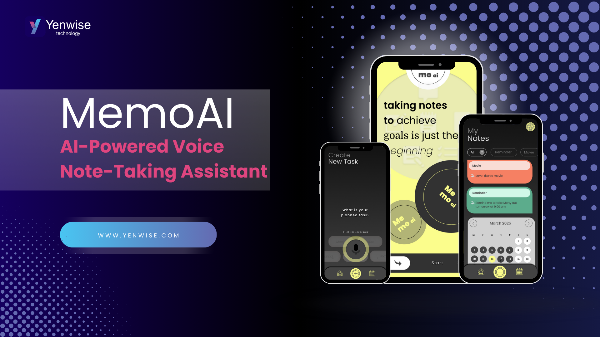

  

# MemoAI 🎙️🧠  
**AI-Powered Voice Note-Taking Assistant**  
A concept demo built with FastAPI, Whisper, LangChain, and Streamlit.

**Real-Life Use Case**
🏃‍♀️ You're walking down the street, rushing to your next meeting.
A friend tells you about a movie you have to watch.
Or maybe your doctor texts you a time for your next appointment.
But your hands are full. Your mind is already busy.
🎙 Just speak. Say it out loud.
"Doctor appointment next Thursday at 10."
"Watch The Tetris Movie."
💡 MemoAI listens, transcribes, and automatically knows what to do:
– Adds the appointment to your calendar
– Sorts the movie into your "To Watch" list
– Reminds you at the right time
✅ No typing. No remembering.
Just voice + intelligence.

> 🚧 This is a portfolio project and not currently available as a production-ready app.  
> It demonstrates advanced use of voice-to-text, LLM-based categorization, and contextual AI prompts.

---

## 🔍 Overview

MemoAI is an intelligent voice assistant designed to:
- Convert voice notes to text using Whisper
- Automatically categorize them with LLMs
- Refine content with contextual AI suggestions
- Retrieve notes using semantic search

Ideal for productivity enthusiasts, creators, and tech-forward professionals.

---

## ⚙️ Tech Stack

### 🧠 AI & NLP
- **Whisper STT** – Real-time voice-to-text conversion
- **LangChain + LLMs** – Intelligent categorization and enrichment
- **Semantic Search** – Contextual note retrieval

### 🖥 Backend
- **FastAPI** – High-performance API framework
- **Async & Multithreading** – For efficient task handling
- **Cloud Storage Ready** – Easily extendable

### 💻 Frontend
- **Streamlit** – Web-based UI (concept version)
- **React Native (Optional)** – For mobile implementation

---

## 📂 Project Structure

MemoAI/ │ ├── app.py # Streamlit frontend ├── api.py / server.py # FastAPI backend (optional variants) ├── recorder.py # Audio recording logic ├── transcriptor.py # Whisper transcription logic ├── category_classifier.py # AI categorization module ├── requirements.txt └── .gitignore

---

## 📝 Features

- 🎙 Real-time voice capture
- 🧠 LLM-driven note classification
- 🗂 Smart reminders, ideas, tasks & more
- 🔍 Semantic keyword + context search
- ☁️ Cloud-ready architecture (planned)

---

## 📦 Status

- 🧪 Concept Demo Only  
- 📱 Mobile version: Planned via React Native  
- 🌐 Hosted: Not yet deployed

---

## 🙋‍♀️ About

This repository is part of my AI + Productivity portfolio.  
If you like the project, feel free to reach out or star ⭐️ it!

🔗 [LinkedIn](https://linkedin.com/in/nursahsogutalici/)  
✉️ [nursahsogut@gmail.com]

---
